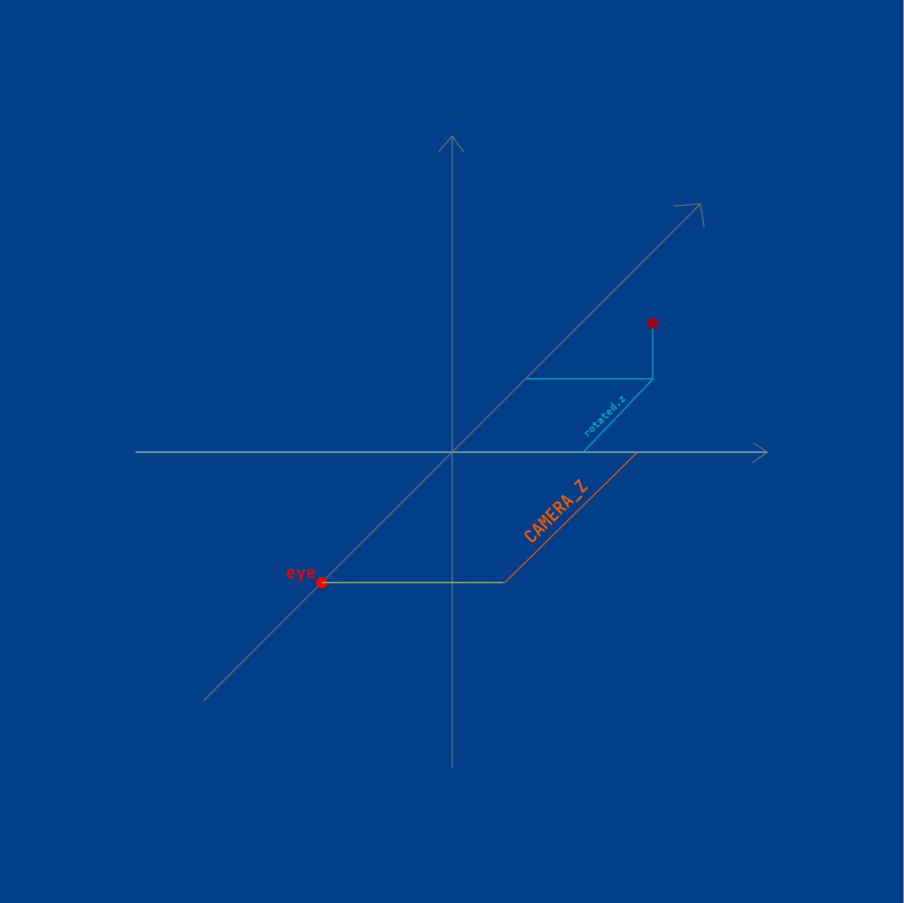
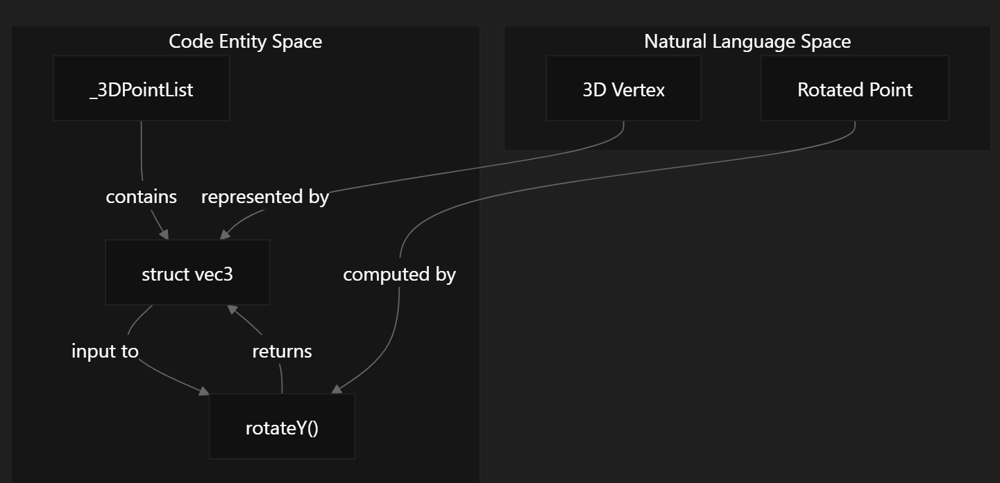
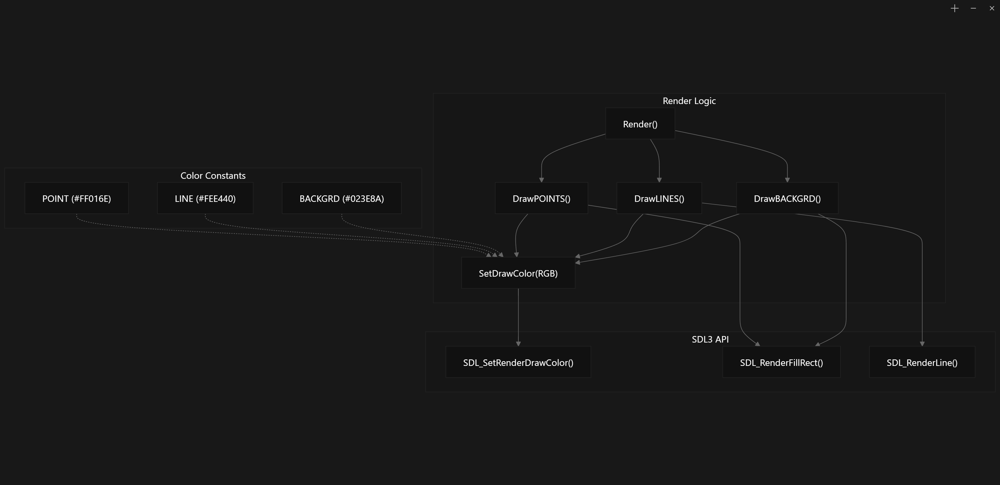

## 实现思路

### 灵感来源

[](https://www.youtube.com/embed/qjWkNZ0SXfo)

## 变量含义

- **RGB**：RGB 是一个结构体，它以 `RGB` 格式来存放一个色值。每一个成员变量的大小范围 [0, 255]
- **vec2**：用来标识线段在 `_2DPointList` 的起始索引和结束索引
- **vec3**：vec3 是一个三维变量，用于存放在三维正交坐标系中的坐标值
- **IsGoing_**：主循环的开关。`true` 代表运行主循环；`false` 代表停止主循环
- **IsLogFPS_**：是否打印当前的帧率
- **IsDrawBACKGRD_**：是否打印背景
- **IsDrawLINE_**：是否打印线段
- **IsDrawPOINTS_**：是否打印点
- **Title_**：窗口的标题文本
- **POINT_SIZE**：渲染“点”的大小。点为一个正方形图像，此变量代表该图像的边长
- **Width_**：窗口的宽度
- **Height_**：窗口的高度
- **FOCAL_LENGTH**：3D 投影参数中的焦距，用于决定透视投影的强度
- **CAMERA_Z**：3D 投影参数中的相机距离
- **rotationY**：3D 投影参数中绕 Y 轴旋转的角度
- **window_**：指向 SDL 窗口对象的指针
- **renderer_**：指向 SDL 渲染器对象的指针
- **BACKGRD**：背景的颜色，`RGB` 格式
- **POINT**：渲染的“点”的颜色，`RGB` 格式
- **LINE**：渲染的线段的颜色，`RGB` 格式
- **_3DPointList**：在标准正交坐标系中的 3 维点的集合, 每个元素的类型为 `vec3`
- **_2DPointList**：经过透视投影和坐标转换后，用于 SDL 渲染的 2 维图形（矩形）的集合，每个元素的类型为 `SDL_FRect`
- **LineList**：渲染的线段列表，每个元素的类型为 `vec2`

## 方法含义

### 示意图集

<table>
  <tr>
    <td></td>
    <td></td>
    <td></td>

  </tr>
</table>


### 更新逻辑 Update()


```
  操作       |   对应变量
3D 原始点       _3DPointList[i]
            ↓
旋转         ↓  rotated
            ↓
计算深度     ↓  depth
            ↓
透视投影     ↓  projectedX & projectedY
            ↓
坐标转换     ↓  transX()
            ↓
2D 渲染点    X  _2DPointList.push_back()
```

### 渲染逻辑 Render()

**顺序：** 
BACKGRD -> SURFACE -> LINE -> POINT
